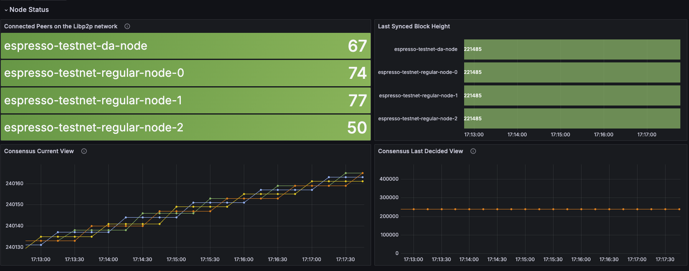

# Espresso Monitor
It's still in an early stage, we build a first version of dashboard that contains the important metrics from [espresso doc](https://docs.espressosys.com/sequencer/guides/running-a-sequencer-node#monitoring)

# Screenshots

Grafana dashboard

# Usage

Step 1: Download the json file in `grafana` folder
Step 2: Replace your datasource id in json file
Step 3: Import the dashboard to your grafana from console

# TODO
- [ ] Find the way to dynamic set datasource
